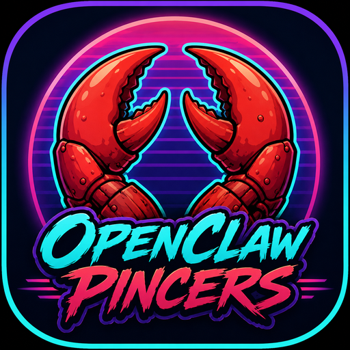

<div align="center">



# OpenClaw Pincers

**Get a grip on your gateway.**

A standalone, cross-platform desktop control center for
[OpenClaw](https://github.com/openclaw/openclaw) — chat, config, cron,
approvals, models, files, logs, and updates. Everything the CLI does,
with claws. Now on Android too.


</div>

---

## Why Pincers?

OpenClaw's gateway speaks a fully-documented WebSocket protocol — but the
only desktop surfaces are a terminal and a browser tab. Pincers is a real
native client: it pairs with your gateway like any other device, signs its
handshakes with its own Ed25519 identity, and puts every control-plane
surface one click away.

- **No terminal required.** First-run onboarding detects your local gateway
  and fills in URL + token for you.
- **Real protocol client.** Not a CLI wrapper, not screen-scraping — the
  same signed WS handshake (protocol v4) the official clients use.
- **Keys stay in Rust.** The device private key never touches JavaScript;
  the frontend only ever receives signatures.
- **13 themes.** From Synthwave '84 to Carapace Noir to The Lobster
  Quadrille. Pick your fighter.

## Features

| Section | What you get |
| --- | --- |
| 💬 **Chat** | Sessions sidebar, streaming deltas, abort, full history |
| 📊 **Dashboard** | Gateway status, health, usage/quota, presence at a glance |
| 🧠 **Models** | Runtime model catalog with search and catalog views |
| ⚙️ **Config** | Live config editor with validated writes + schema lookup drill-down |
| 📁 **Files** | Agent workspace browser (gateway-confined, read-only) |
| ⏰ **Cron** | Create, enable/disable, run-now, and delete scheduled jobs |
| 🛡️ **Approvals** | Exec approval inbox with auto-refresh — allow/deny in one click |
| ✨ **Skills** | Installed skills grid |
| 🔧 **Tools** | Full gateway tool catalog with filter |
| 📜 **Logs** | Gateway log tail with follow mode |
| 🖥️ **System** | Channel status, nodes, one-click gateway updates |
| 🚀 **Setup** | Onboarding hub + setup wizard over RPC |

## Install

### Linux

| Distro | Package |
| --- | --- |
| Debian / Ubuntu | `sudo dpkg -i OpenClaw\ Pincers_*_amd64.deb` |
| Fedora / openSUSE | `sudo dnf install OpenClaw\ Pincers-*.x86_64.rpm` |
| Any distro | `.AppImage` — `chmod +x` and run |
| Arch / CachyOS / Manjaro | `cd packaging && makepkg -si` |

Runtime deps: `webkit2gtk-4.1`, `gtk3`, `libsoup3` (preinstalled on most desktops).

### macOS

Download the DMG for your chip (`arm64` = Apple Silicon, `x64` = Intel) and
drag to Applications. Builds are currently unsigned — on first launch:

```bash
xattr -dr com.apple.quarantine "/Applications/OpenClaw Pincers.app"
```

### Windows

Download the `.msi` (or NSIS `.exe`) and install. Builds are currently
unsigned — click **More info → Run anyway** on the SmartScreen prompt.

## First run

1. Launch Pincers. 🦞
2. Hit **⚡ Detect local gateway** — it reads `~/.openclaw/openclaw.json`
   and fills in the gateway URL + auth token (local installs only; remote
   gateways: paste URL + token manually).
3. Hit **Connect**. On first contact the gateway asks you to approve the
   new device — the app shows you the exact `openclaw devices approve`
   command and auto-retries until you're in.

## Build from source

Prereqs: Rust toolchain, Node 18+, and the
[Tauri system dependencies](https://v2.tauri.app/start/prerequisites/) for
your platform.

```bash
npm install
npm run tauri dev      # dev build with hot reload
npm run tauri build    # release bundles for your host OS
npm run check          # svelte-check typecheck
```

Releases are built by GitHub Actions: push a `v*` tag and the pipeline
ships Linux (deb/rpm/AppImage), macOS (arm64 + x64 dmg), and Windows
(msi/nsis) artifacts to a GitHub Release.

### Android

Prereqs: JDK 17, Android SDK (platform 36, build-tools 36) + NDK r28,
and Rust Android targets:

```bash
rustup target add aarch64-linux-android armv7-linux-androideabi \
  i686-linux-android x86_64-linux-android
export JAVA_HOME=/usr/lib/jvm/java-17-openjdk
export ANDROID_HOME=$HOME/Android/Sdk
export NDK_HOME=$ANDROID_HOME/ndk/28.2.13676358

npx tauri android init                      # once — scaffolds src-tauri/gen/android
npx tauri android dev                       # dev on a connected device/emulator
npx tauri android build --apk --target aarch64   # signed release APK
```

Release signing uses `src-tauri/gen/android/keystore.properties`
(gitignored) pointing at `pincers-release.jks`. The APK enables cleartext
traffic so it can reach plain `ws://` gateways on your LAN or tailnet —
pair it like any new device (`openclaw devices approve`).

#### Connecting your phone from anywhere (Tailscale)

Gateways bind to loopback by default, and many routers block
client-to-client traffic ("AP isolation") — so the reliable path is a
tailnet:

1. Set `gateway.bind: "lan"` in `~/.openclaw/openclaw.json` and restart
   the gateway (token auth is required for non-loopback binds — the
   default).
2. If you run a firewall, allow the port (e.g. `sudo ufw allow 18789/tcp`).
3. Install [Tailscale](https://tailscale.com) on both the gateway host and
   your phone, sign into the same account.
4. In Pincers on your phone, use the host's tailnet IP:
   `ws://100.x.y.z:18789` + your gateway token.
5. First connect raises a pairing request — approve it:
   `openclaw devices approve <requestId>`
   (the requestId shows in the app, or in the gateway log).

Works on home wifi, mobile data, coffee-shop wifi — anywhere Tailscale
reaches. Note: Android allows one VPN at a time, so Tailscale and other
VPN apps trade places on the phone.

## Architecture

```
┌────────────────────────────────────────────┐
│ Svelte 5 UI (13 sections, theme engine)    │
├────────────────────────────────────────────┤
│ GatewayClient (TypeScript)                 │
│   WS transport · req/res correlation       │
│   event routing · tolerant extraction      │
├────────────────────────────────────────────┤
│ Rust backend (Tauri commands)              │
│   Ed25519 keygen · storage · signing       │
│   local gateway detection                  │
├────────────────────────────────────────────┤
│ ws://your-gateway (protocol v4)            │
└────────────────────────────────────────────┘
```

```
src/lib/gateway/protocol.ts   Protocol v4 types (frames, handshake, chat events)
src/lib/gateway/client.ts     GatewayClient — transport, handshake, events
src/lib/state/app.svelte.ts   Svelte 5 runes app state + RPC passthrough
src/lib/views/*.svelte        The 12 sections
src/lib/themes.ts             Theme catalog (13 themes)
src-tauri/src/lib.rs          Device identity + signing + local detection
.github/workflows/release.yml Cross-platform release pipeline
```

### Protocol notes (learned from the source, so you don't have to)

- `client.id` is a **closed enum** — external apps must use `gateway-client`
  with mode `ui`.
- Device auth payload v3:
  `v3|deviceId|clientId|clientMode|role|scopes|signedAtMs|token|nonce|platform|deviceFamily`
  (scopes normalized/sorted, platform lowercased).
- `device.id` = sha256hex(raw Ed25519 public key); `device.publicKey` =
  base64url(raw key); signature = base64url(Ed25519 signature over payload).
- Gateways with `gateway.auth.token` require the token in **both**
  `auth.token` **and** the signed payload.
- First connect from a new device creates a pending pairing request;
  loopback connects may be auto-approved.
- `chat.send` acks with `{runId, status:"started"}`; responses stream as
  `chat` events (`delta`/`final`/`aborted`/`error`, deltas via `deltaText`,
  `replace=true` for non-prefix rewrites).

## Roadmap

- [ ] Embedded terminal (gateway PTY over `terminal.*`)
- [x] Node pairing with QR codes (`device.pair.setupCode`)
- [x] Per-session model picker in chat
- [ ] Talk/TTS voice mode
- [x] Desktop notifications for approvals
- [ ] Signed macOS/Windows builds

## Contributing

Issues and PRs welcome. If a gateway RPC returns something a section doesn't
render richly, the app falls back to a JSON inspector — screenshots of those
fallbacks are bug reports gold.

## License

MIT — see [LICENSE](LICENSE).

---

<div align="center">
  <sub>Built with claws by <a href="https://github.com/synthalorian">synth</a> &amp; synthclaw 🎹🦞 · This is the wave.</sub>
</div>
